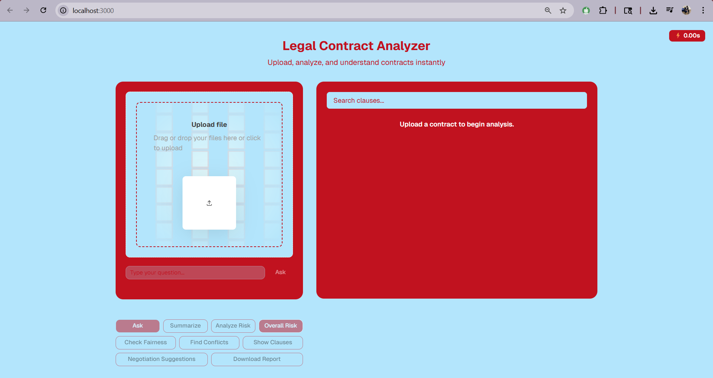

# Legal Contract Analyzer

 AI-powered Legal Intelligence System that analyzes contracts using Retrieval-Augmented Generation (RAG) and a local LLM. Built for fast, explainable legal insights with a modular pipeline and a modern SaaS-style interface.

 ## Product Highlights
 - 📄 PDF Upload & Processing
 - 🧠 RAG-based Question Answering
 - ⚠️ Risk Analysis with explanations
 - 📊 Clause Breakdown by type and intent
 - 🔍 Clause Search across the document
 - ⚡ Latency Indicator for every response
 - 🧩 Modular AI Pipeline (swap embeddings, LLM, or vector store)

 ## Architecture
 ```text
 PDF → Text Extraction → Chunking → Embeddings → FAISS → Retrieval → LLM → Response
 ```

 ## Tech Stack
 - Backend: FastAPI
 - Frontend: Next.js + shadcn/ui
 - Vector Search: FAISS
 - Embeddings: Sentence Transformers
 - Local LLM: LM Studio (Mistral)

 ## Screenshots
 - Upload view with PDF preview and processing status
 - QA panel with grounded answers and sources
 - Risk analysis cards with rationale and severity
 - Clause explorer with filters and search
 - Response latency badge

 ## Setup
 ### Backend
 ```bash
 python -m venv .venv
 .venv\\Scripts\\activate
 pip install -r requirements.txt
 uvicorn app.main:app --reload
 ```

 ### Frontend
 ```bash
 npm install
 npm run dev
 ```

 ## Usage
 1. Upload a contract PDF.
 2. Choose an action: Ask, Summarize, or Analyze Risk.
 3. Review results with sources, clause breakdowns, and latency indicators.

 ## Project Structure
 ```text
 backend/
 frontend/
 ```

 ## Future Improvements
 - Fairness Analysis
 - Conflict Detection
 - Report Generation
